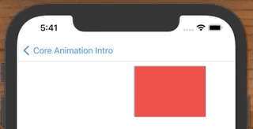
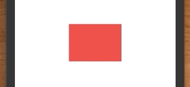
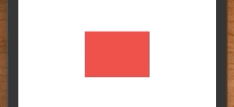
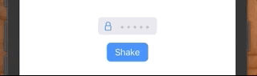
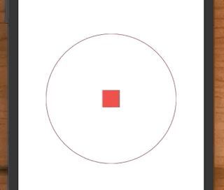

## Core Animation 動畫練習


## Move



**MoveViewController.swift**

```swift
import UIKit

class MoveViewController: UIViewController {

    let redView = UIView(frame: CGRect(x: 20, y: 100, width: 140, height: 100))
    let button = makeButton(withText: "Animate")

    override func viewDidLoad() {
        super.viewDidLoad()
        
        redView.backgroundColor = .systemRed
        
        button.translatesAutoresizingMaskIntoConstraints = false
        button.addTarget(self, action: #selector(buttonTapped(_:)), for: .primaryActionTriggered)
        
        view.addSubview(redView)
        view.addSubview(button)
        
        NSLayoutConstraint.activate([
            view.safeAreaLayoutGuide.bottomAnchor.constraint(equalToSystemSpacingBelow: button.bottomAnchor, multiplier: 2),
            button.centerXAnchor.constraint(equalTo: view.centerXAnchor),
        ])
    }
    
    func animate() {
        let animation = CABasicAnimation()
        animation.keyPath = "position.x"
        animation.fromValue = 20 + 140/2
        animation.toValue = 300
        animation.duration = 1
        
        redView.layer.add(animation, forKey: "basic")
        redView.layer.position = CGPoint(x: 300, y: 100 + 100/2) // update to final position
    }

    @objc func buttonTapped(_ sender: UIButton) {
        animate()
    }
}

// MARK: - Factories

func makeButton(withText text: String) -> UIButton {
    let button = UIButton()
    button.translatesAutoresizingMaskIntoConstraints = false
    button.setTitle(text, for: .normal)
    button.titleLabel?.adjustsFontSizeToFitWidth = true
    button.contentEdgeInsets = UIEdgeInsets(top: 8, left: 16, bottom: 8, right: 16)
    button.backgroundColor = .systemBlue
    button.layer.cornerRadius = 8
    return button
}
```

## Scale


**ScaleViewController.swift**

```swift
import UIKit

class ScaleViewController: UIViewController {

    let redView = UIView()
    let _width: CGFloat = 140
    let _height: CGFloat = 100
    
    let button = makeButton(withText: "Animate")

    override func viewDidLoad() {
        super.viewDidLoad()
        
        redView.backgroundColor = .systemRed
        
        button.translatesAutoresizingMaskIntoConstraints = false
        button.addTarget(self, action: #selector(buttonTapped(_:)), for: .primaryActionTriggered)
        
        view.addSubview(redView)
        view.addSubview(button)
        
        NSLayoutConstraint.activate([
            view.safeAreaLayoutGuide.bottomAnchor.constraint(equalToSystemSpacingBelow: button.bottomAnchor, multiplier: 2),
            button.centerXAnchor.constraint(equalTo: view.centerXAnchor),
        ])
    }
    
    override func viewDidAppear(_ animated: Bool) {
        super.viewDidAppear(animated)
        
        redView.frame = CGRect(x: view.bounds.midX - _width/2,
                               y: view.bounds.midY - _height/2,
                               width: _width, height: _height)
    }
    
    func animate() {
        let animation = CABasicAnimation()
        animation.keyPath = "transform.scale"
        animation.fromValue = 1
        animation.toValue = 2
        animation.duration = 0.4
        
        redView.layer.add(animation, forKey: "basic")
        redView.layer.transform = CATransform3DMakeScale(2, 2, 1) // update
    }

    @objc func buttonTapped(_ sender: UIButton) {
        animate()
    }
}
```

## Rotate



**RotateViewController.swift**

```swift
import UIKit

class RotateViewController: UIViewController {

    let redView = UIView()
    let _width: CGFloat = 140
    let _height: CGFloat = 100
    
    let button = makeButton(withText: "Animate")

    override func viewDidLoad() {
        super.viewDidLoad()
        
        redView.backgroundColor = .systemRed
        
        button.translatesAutoresizingMaskIntoConstraints = false
        button.addTarget(self, action: #selector(buttonTapped(_:)), for: .primaryActionTriggered)
        
        view.addSubview(redView)
        view.addSubview(button)
        
        NSLayoutConstraint.activate([
            view.safeAreaLayoutGuide.bottomAnchor.constraint(equalToSystemSpacingBelow: button.bottomAnchor, multiplier: 2),
            button.centerXAnchor.constraint(equalTo: view.centerXAnchor),
        ])
    }
    
    override func viewDidAppear(_ animated: Bool) {
        super.viewDidAppear(animated)
        
        redView.frame = CGRect(x: view.bounds.midX - _width/2,
                               y: view.bounds.midY - _height/2,
                               width: _width, height: _height)
    }
    
    func animate() {
        let animation = CABasicAnimation()
        animation.keyPath = "transform.rotation.z" // Note: z-axis
        animation.fromValue = 0
        animation.toValue = CGFloat.pi / 4
        animation.duration = 1
        
        redView.layer.add(animation, forKey: "basic")
        redView.layer.transform = CATransform3DMakeRotation(CGFloat.pi / 4, 0, 0, 1)
    }

    @objc func buttonTapped(_ sender: UIButton) {
        animate()
    }
}
```

## Shaking



**ShakeViewController.swift**

```swift
import UIKit

class ShakeViewController: UIViewController {
    
    let textField = UITextField()
    let shakeButton = makeButton(withText: "Shake")
    
    override func viewDidLoad() {
        super.viewDidLoad()
        setup()
        layout()
        animate()
    }
}

// MARK: - Setup

extension ShakeViewController {
    
    func setup() {
        textField.setIcon(UIImage(systemName: "lock")!)

        textField.translatesAutoresizingMaskIntoConstraints = false
        textField.backgroundColor = .systemGray5
        textField.font = UIFont.preferredFont(forTextStyle: .title1)
        textField.layer.cornerRadius = 6
        textField.placeholder = "  •••••  "
        
        shakeButton.addTarget(self, action: #selector(shakeTapped(_:)), for: .primaryActionTriggered)
        
        view.addSubview(textField)
        view.addSubview(shakeButton)
    }
    
    func layout() {
        NSLayoutConstraint.activate([
            textField.topAnchor.constraint(equalTo: view.safeAreaLayoutGuide.topAnchor, constant: 60),
            textField.centerXAnchor.constraint(equalTo: view.centerXAnchor),
            
            shakeButton.topAnchor.constraint(equalToSystemSpacingBelow: textField.bottomAnchor, multiplier: 2),
            shakeButton.centerXAnchor.constraint(equalTo: view.centerXAnchor),
        ])
    }
    
    @objc func shakeTapped(_ sender: UIButton) {
        animate()
    }
}

// MARK: - Animations

extension ShakeViewController {

    func animate() {
        let animation = CAKeyframeAnimation()
        animation.keyPath = "position.x"
        animation.values = [0, 10, -10, 10, 0]
        animation.keyTimes = [0, 0.16, 0.5, 0.83, 1]
        animation.duration = 0.4

        animation.isAdditive = true
        textField.layer.add(animation, forKey: "shake")
    }
}

extension UITextField {
    
    func setIcon(_ image: UIImage) {
        let iconView = UIImageView(frame: CGRect(x: 10, y: 5, width: 20, height: 20))
        iconView.image = image
        
        let iconContainerView: UIView = UIView(frame: CGRect(x: 20, y: 0, width: 30, height: 30))
        iconContainerView.addSubview(iconView)
        
        leftView = iconContainerView
        leftViewMode = .always
    }
}
```

## Circling



```swift
import UIKit

class CirclingViewController: UIViewController {

    let redView = UIView()
    let _width: CGFloat = 40
    let _height: CGFloat = 40
    
    let redCircle = UIImageView()
    let _diameter: CGFloat = 300
        
    let button = makeButton(withText: "Animate")

    override func viewDidLoad() {
        super.viewDidLoad()
        
        redView.backgroundColor = .systemRed
//        redCircle.backgroundColor = .systemBlue
        
        button.translatesAutoresizingMaskIntoConstraints = false
        button.addTarget(self, action: #selector(buttonTapped(_:)), for: .primaryActionTriggered)
        
        boundingRect.backgroundColor = .gray
        view.addSubview(boundingRect)
        view.addSubview(redView)
        view.addSubview(redCircle)
        view.addSubview(button)
        
        NSLayoutConstraint.activate([
            view.safeAreaLayoutGuide.bottomAnchor.constraint(equalToSystemSpacingBelow: button.bottomAnchor, multiplier: 2),
            button.centerXAnchor.constraint(equalTo: view.centerXAnchor),
        ])
    }
    
    override func viewDidAppear(_ animated: Bool) {
        super.viewDidAppear(animated)
        
        // draw box
        redView.frame = CGRect(x: view.bounds.midX - _width/2,
                               y: view.bounds.midY - _height/2,
                               width: _width, height: _height)

        // draw circle
        redCircle.frame = CGRect(x: view.bounds.midX - _diameter/2,
                               y: view.bounds.midY - _diameter/2,
                               width: _diameter, height: _diameter)

        //使用指定的大小創建渲染器
        let renderer = UIGraphicsImageRenderer(size: CGSize(width: _diameter, height: _diameter))

        //使用繪圖動作創建圖像
        let img = renderer.image { ctx in
            
            // 在渲染器內繪製圖像
            let rectangle = CGRect(x: 0,
                                   y: 0,
                                   width: _diameter,
                                   height: _diameter)

            //設定描邊顏色
            ctx.cgContext.setStrokeColor(UIColor.red.cgColor)
            // 設定填充顏色
            ctx.cgContext.setFillColor(UIColor.clear.cgColor)
            // 設定描邊寬度
            ctx.cgContext.setLineWidth(1)
            //使用 addEllipse 在指定的矩形內添加一個橢圓(只有添加)
            ctx.cgContext.addEllipse(in: rectangle)
            //使用 drawPath(using:) 方法繪製橢圓，同時使用 .fillStroke 來實現描邊和填充。
            ctx.cgContext.drawPath(using: .fillStroke)
        }

        redCircle.image = img
    }
    
    func animate() {
        //定義動畫範圍
        let boundingRect = CGRect(x: -_diameter/2,
                                  y: -_diameter/2,
                                  width: _diameter,
                                  height: _diameter)
        
        let orbit = CAKeyframeAnimation()
        //設定動畫的屬性，position，表示位置
        orbit.keyPath = "position"
        
        //設定了動畫的路徑，使用 CGPath 創建了一個橢圓形的路徑
        orbit.path = CGPath(ellipseIn: boundingRect, transform: nil)
        
        
        orbit.duration = 2
        //設定為 true 以便在動畫期間將結果添加到屬性的當前值
        orbit.isAdditive = true
        //重複次數
        orbit.repeatCount = HUGE
        //.paced: 設定了計算模式，這裡是 .paced，表示動畫將以相同的速度進行
        orbit.calculationMode = CAAnimationCalculationMode.paced;
        orbit.rotationMode = CAAnimationRotationMode.rotateAuto;

        redView.layer.add(orbit, forKey: "redbox")
    }

    @objc func buttonTapped(_ sender: UIButton) {
        animate()
    }
}
```


### Reference

- [Introduction to Core Animation (iOS/Swift)](https://www.youtube.com/watch?v=93bfh3GK79s&list=PLEVREFF3xBv5XocgSyKKeoOwU6YF2osK5&index=5)

